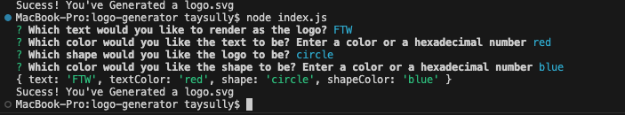
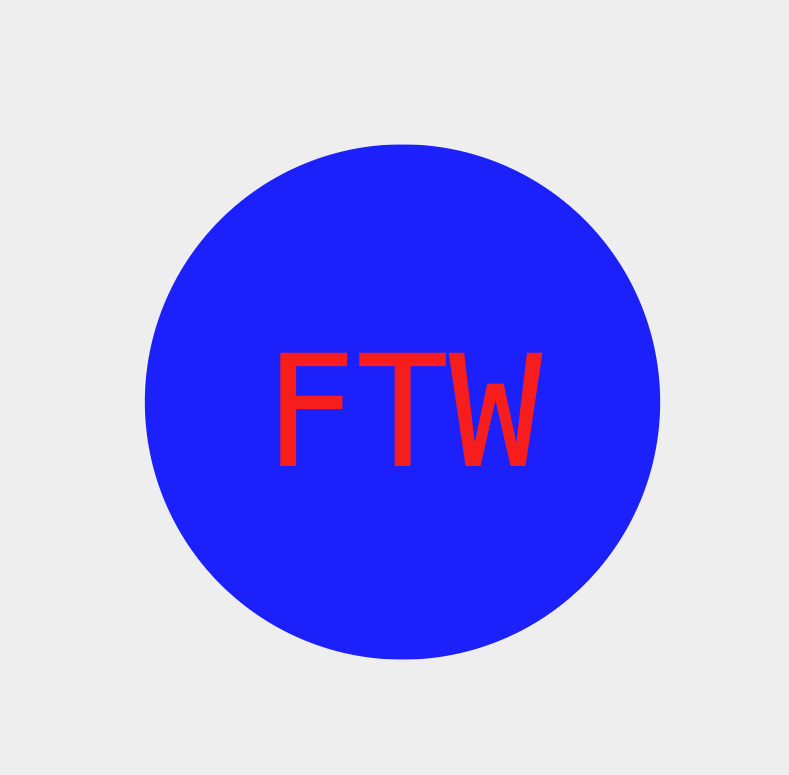
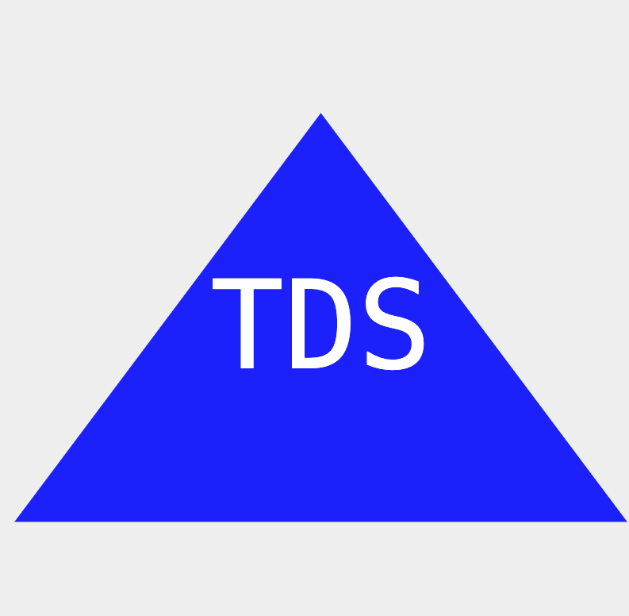

# Logo-Generator

## Who needs graphic designers these days! Not me, because I have this handy Logo-Generator right at my fingertips! This easy to use logo generator will render you a simple SVG logo with your 3-letter text of your choice from a short series of questions. Easy does it!

## Table of Contents

- [Installation](#installation)
- [Usage](#usage)
- [Credits](#credits)
- [License](#license)
- [Questions](#questions)

## Installation

In order to install this project, you must have Node.js, and run an npm install for Jest and Inquirer. Once you have that, simply run node index.js in the terminal

## Usage/Tests

For a full walkthrough of the usage of this application, click this here [link](https://watch.screencastify.com/v/tmkKjrjARyiFMtNpn7VL)!

Once you run node index.js in the integrated terminal, answer the prompts run by inquirer in order to render a logo of your choosing. Once you've finished the questions, and see the success message, check out your newly rendered svg logo! If you're viewing in VS code, be sure to install an SVG preview app to view it properly!

- 
- 
- 
- 

## Contributing

The collaborators on this project include me, myself, and I -- tayskully

Tutorials followed include Columbia University EdX's Coding Bootcamp 2023, as well as:  
 [Github Docs](https://docs.github.com/en)  
 [developer mozilla](https://developer.mozilla.org/en-US/)  
 [Dev.to](https://dev.to/)  
 [Code Academy blogs](https://www.codecademy.com/resources/blog/)  
 [W3 Schools](https://www.w3schools.com/)

Special thanks to Katie Redford, my tutor,for the additional guidance

## License

    MIT License

## Questions

Reach out to me if you have any questions!

- Github: [tayskully](https://github.com/tayskully)
- LinkedIn: [taylordaniellesullivan](https://www.linkedin.com/in/taylordaniellesullivan/)
- Email: taysully94@gmail.com

---

## Badges

